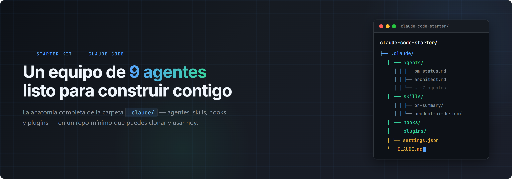
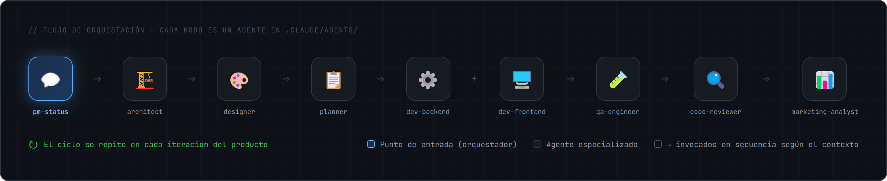

<p align="center">
  <a href="LICENSE"></a>
  
  
</p>

Un proyecto **terminado y mínimo** que muestra la **anatomía de `.claude/`** en Claude Code: qué hace cada
archivo y por qué importa. Clónalo, ábrelo con Claude Code y desde el primer minuto tendrás un **equipo listo**
+ las reglas que Claude lee antes de empezar.

> **No necesitas ser programador.** Tú dices qué quieres construir, en tus palabras; el equipo se encarga del cómo.

> Es el ejemplo "Proyecto Optimus": cada pieza está comentada para que la copies a tus proyectos.

## Empezar en 3 pasos

> ¿Primera vez con Claude Code? Sigue el paso a paso detallado en **[`EMPIEZA-AQUI.md`](EMPIEZA-AQUI.md)**.

1. **Clona o descarga** este repo y entra a la carpeta.
   ```bash
   git clone <url-del-repo>
   cd claude-code-starter
   ```
2. **Abre la carpeta con Claude Code** (ejecuta `claude` en la terminal, dentro del proyecto).
3. **Pídele lo que quieras construir.** Claude lee `CLAUDE.md` automáticamente (las reglas y cómo orquesta al
   equipo) y arranca. Ejemplo:
   > *"Quiero que el sistema permita que los usuarios se registren con su correo."*

   El agente **`pm-status`** te **entrevistará en lenguaje natural** (sin tecnicismos) para entender bien qué
   necesitas, y luego el equipo construye: **architect → designer → planner → dev-backend → dev-frontend →
   code-reviewer → qa-engineer**. Cuando quieras, edita `CLAUDE.md` con las reglas reales de tu proyecto.

## Estructura

```
claude-code-starter/
├── CLAUDE.md                     # manual del agente (lo lee PRIMERO) + cómo orquesta al equipo
├── README.md                     # esto que estás leyendo
├── EMPIEZA-AQUI.md               # guía paso a paso (ideal para la primera vez)
├── examples/
│   └── prompts.md                # prompts listos para copiar y arrancar
├── docs/                         # guía visual de Claude Code
└── .claude/
    ├── settings.json             # panel de control: permisos + hooks
    ├── skills/
    │   └── product-ui-design/SKILL.md  # diseñar interfaces de producto (cuidadas y consistentes)
    ├── agents/                    # equipo de 9 sub-agentes (cada uno aislado, con sus tools)
    │   ├── pm-status.md           #   entrevista requerimientos + reporta estado
    │   ├── architect.md           #   arquitectura, stack, módulos
    │   ├── designer.md            #   sistema visual y UX (usa la skill product-ui-design)
    │   ├── planner.md             #   historias de usuario + backlog priorizado
    │   ├── dev-backend.md         #   lógica, APIs, datos
    │   ├── dev-frontend.md        #   UI, componentes, estilos
    │   ├── qa-engineer.md         #   plan de pruebas + tests + seguridad
    │   ├── code-reviewer.md       #   revisor senior del diff
    │   └── marketing-analyst.md   #   audita una web/landing (mensaje, CTA, UX, SEO)
    ├── commands/
    │   └── commit.md              # atajo /commit
    ├── hooks/
    │   └── format.sh              # script que corre solo (formatea tras cada edición)
    └── plugins/
        └── optimus/               # empaqueta agente + command + hook en un pack
            └── .claude-plugin/plugin.json
```

## Qué hace cada pieza

| Pieza | Para qué |
|---|---|
| **`CLAUDE.md`** | Reglas, estilo y decisiones del proyecto + **cómo orquesta al equipo**. Claude lo lee antes de cualquier cosa. Sin esto, adivina. |
| **`.claude/settings.json`** | Permisos (qué corre sin preguntar / qué se niega) y registro de hooks. |
| **`skills/`** | Capacidades reutilizables. Cada skill = una carpeta con `SKILL.md`. |
| **`agents/`** | Sub-agentes: otro Claude aislado, con su propio contexto, tools y permisos. Trae un **equipo de 9 listo** (abajo). |
| **`commands/`** | Atajos `/comando` (el nombre del archivo = el comando). |
| **`hooks/`** | Scripts que se disparan solos en eventos (ej. formatear después de editar). |
| **`plugins/`** | Empaqueta agents + commands + hooks juntos para instalar/compartir de una. |

## El equipo de 9 agentes (listo para arrancar)

Sirven para **desarrollo** y también para **marketing**. Son genéricos: se adaptan a cualquier stack o proyecto.

| Agente | Para qué |
|---|---|
| `pm-status` | **Te entrevista** en lenguaje natural para entender qué quieres, y te da el estado del proyecto. |
| `architect` | Define cómo se arma el proyecto: estructura y tecnologías. |
| `designer` | Diseña cómo se ve y se siente (usa la skill `product-ui-design`). |
| `planner` | Convierte lo que pediste en una lista de tareas, en orden. |
| `dev-backend` | Construye la lógica y los datos (el "motor" de tu app). |
| `dev-frontend` | Construye la interfaz: pantallas, botones, formularios. |
| `qa-engineer` | Prueba que todo funcione y sea seguro antes de entregar. |
| `code-reviewer` | Revisa que el cambio esté bien y caza errores antes de publicar. |
| `marketing-analyst` | Audita una web/landing: mensaje, llamado a la acción, claridad, SEO. |

## Cómo trabaja el equipo (orquestación)

Ante un pedido de **construir o cambiar algo**, Claude **no programa directo**: orquesta al equipo por jerarquía,
pasando la salida de cada agente como entrada del siguiente, y con pausas para validar contigo.



```
pm-status (te entrevista) → architect → designer → planner →
dev-backend → dev-frontend → code-reviewer → qa-engineer → ↻ (siguiente iteración)
```

El detalle (cuándo se salta un paso, gates de validación, atajo para cambios triviales) está en `CLAUDE.md`,
sección **"Cómo trabaja el equipo de agentes"**. Es reusable tal cual en tus proyectos.

## Skills incluidas

- **`product-ui-design`** — base de conocimiento para diseñar interfaces que se ven profesionales: paleta y
  tipografía, componentes, estados (vacío/carga/error/éxito), responsive y accesibilidad. La usa el agente `designer`.

## Notas

- Los **plugins** se instalan/comparten vía el mecanismo de plugins de Claude Code; aquí va el `plugin.json`
  de ejemplo para que veas su forma. Revisa la documentación oficial para el flujo de instalación vigente.
- Ajusta `hooks/format.sh` y los permisos de `settings.json` a tu stack.
- En `docs/` hay una **guía visual** de Claude Code para empezar.

---

## ⭐ ¿Te gustó este starter?

<p align="center">
  Si te sirvió, déjale una estrella ⭐ y <strong>no olvides seguirnos</strong> para más 👇
</p>
<p align="center">
  <a href="https://instagram.com/lomejordeia">
    
  </a>
</p>

---

Licencia MIT — úsalo y modifícalo libre.
